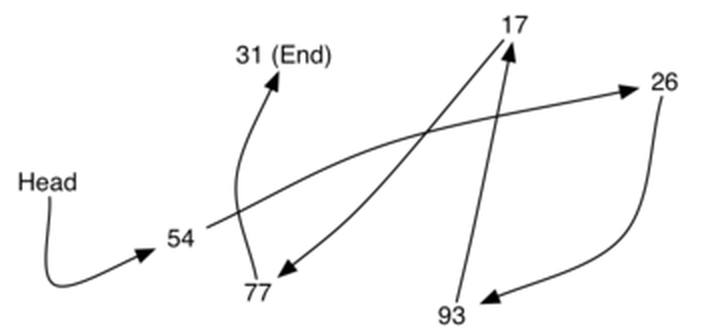

[Back to Welcome Page](0-welcome.md)

# Linked Lists

Linked lists in Python are a set of nodes connected by pointers. Each linked list contains a _head_ and a _tail_ which marks the beginning and end of the linked list, respectively. The head is simply the first node in the sequence, while the tail is the last node in the sequence. Each node in the linked list contains both a value and a pointer that directs you to the node that is next in the sequence. When you find a null value in a pointer, you know you have found the tail. This is called a singly-linked list.

We also have doubly-linked lists which also have a pointer that points to the previous node, which enables you to traverse from tail to head instead of just head to tail.

^image^ ^credit:^ ^https://medium.com/journey-of-one-thousand-apps/data-structures-in-the-real-world-508f5968545a^

However, instead of being in a nice organized row, the nodes are located at any given point in storage. This is why the pointer is necessary, as it directs you to the location in memory in which to find the next node.

^image^ ^credit:^ ^https://miro.medium.com/max/708/1*UPaOfIKoTaud0sopjvrPXg.png^

"Wow, this sounds messy, why would we do something like this!?" This type of organization enables you to have a dynamically sized list as you can grab any available point in memory for your next node. No need to set a pre-allotted amount of memory for your list or worry about availability of concurrent slots in data. It's also more efficient to add or remove items to the beginning of a linked list than it is in a dynamic array. Operations on a linked list are either O(1) or O(n), with O(n) being on insertion and removal from the middle of the list.

### Inserting a node into a Linked List

Let's start by taking a look at how to add a new node to the beginning or end of a linked list. Let new_node be the new node we will insert into the linked list, cur_head will be the current node that is at the head of the linked list and cur_tail will be the current node at the end of the linked list.

| Insert at Head                    | Insert at Tail                    | Explanation                                                                                           |
| --------------------------------- | --------------------------------- | ----------------------------------------------------------------------------------------------------- |
| new_node = LinkedList.Node(value) | new_node = LinkedList.Node(value) | Create the node for insertion                                                                         |
| new_node.next = self.head         | new_node.prev = self.tail         | Set the pointer on the new node to point to the current head/tail, the other pointer will remain null |
| self.head.prev = new_node         | self.tail.next = new_node         | Set the current head/tail pointer to the new node                                                     |
| self.head = new_node              | self.tail = new_node              | Make the new node the head/tail                                                                       |

Great! Now, let's insert a node into the middle of the linked list. This takes an extra step since the insertion impacts two nodes, instead of just one. We will use cur_node as the node we are inserting after. We will first update the new node to have the correct pointer values, then we will change the prev value on the node to the right of insertion and finally we will update the next value on the node we are inserting after.

| Insert in Middle                  | Explanation                                                                                                |
| --------------------------------- | ---------------------------------------------------------------------------------------------------------- |
| new_node = LinkedList.Node(value) | Create the node for insertion                                                                              |
| new_node.prev = cur_node          | The new_node's prev value points to cur_node                                                               |
| new_node.next = cur_node.next     | The new_node's next value points to cur_node's next value (the node that will be to the right of new_node) |
| cur_node.next.prev = new_node     | The prev value on the node to the right of our new_node points to new_node                                 |
| cur_node.next = new_node          | The cur_node's next value points to new_node                                                               |

### Remove a node from a Linked List

To remove a node from the beginning or end of a linked list is pretty simple. You will remove the pointer references to the node being removed and set the head or tail to the new first or last node of the Linked List.

| Remove from head           | Remove from tail           | Explanation                                                                            |
| -------------------------- | -------------------------- | -------------------------------------------------------------------------------------- |
| self.head.next.prev = None | self.tail.prev.next = None | Remove the pointer reference to the head or tail (respectively) on the node next to it |
| self.head = self.head.next | self.tail = self.tail.prev | Set the head or tail to the node that was next to it                                   |

Removing from the middle is pretty simple as well, just two steps which involve updating the next and prev values of the nodes to the left and right of the node to remove. We will use cur_node to represent the node to be removed.

| Remove from middle                 | Explanation                                                                                                                 |
| ---------------------------------- | --------------------------------------------------------------------------------------------------------------------------- |
| cur_node.next.prev = cur_node.prev | Change the prev value on the node to the right to point to the node to the left of cur_node, which is cur_node's prev value |
| cur_node.prev.next = cur_node.next | Change the next value on the node to the left to point to the node to the right of cur_node, which is cur_node's next value |

## Real world use-cases

You may be thinking that this is all great, but when would someone actually use this? What is the real-world application of linked lists? One example of use would be a music player. Each song is connected in a linked lists, so pressing the forward button is essentially doing a cur_node.next() and the backward button would be equivalent to a cur_node.prev(). While talking about stacks, We used the back button on your browser as an example, but most browsers offer the ability to go forward in your history as well. Because of this implementation, we can see that a linked_lists provides a way to track which web pages have been visited and in what order.

## Code Example

For the code example we will look at inserting a node to the end of a linked list, into the middle and then traversing the list and returning the values. The goal is to end up with the 7 Harry Potter titles, in order, but I've left some stray values for your challenge problem below.

```
class LinkedList:
    """
    LinkedList data structure is implemented using the
    LinkedList outer-class and an inner-class for the node
    """

    class Node:
        """
        Every node will have a next, prev, and data value that can be accessed
        """

        def __init__(self, data):
            """
            Sets the default values for the node upon creation
            """
            self.data = data
            self.next = None
            self.prev = None

    def __init__(self):
        """
        Initialize an empty linked list.
        """
        self.head = None
        self.tail = None

    def insert_into(self, existing_value, new_value):
        """
        Insert a new node after the first node containing a specified value
        """
        cur_node = self.head
        while cur_node is not None:

            if cur_node.data == existing_value:  # check to see if node matches existing_value

                if cur_node == self.tail:
                    # re-use the function for inserting at the tail
                    insert_tail(new_value)

                else:
                    new_node = LinkedList.Node(new_value)  # create new_node
                    new_node.prev = cur_node  # set the prev value on the new_node
                    new_node.next = cur_node.next  # set the next value on the new_node
                    cur_node.next.prev = new_node  # update the prev value to point to new_node
                    cur_node.next = new_node  # update the next value of cur_node to point to new_node

                return

            cur_node = cur_node.next

    def insert_tail(self, value):
        """
        Insert a new node at the back of the Linked List
        """
        new_node = LinkedList.Node(value)

        if self.head is None:  # if list is empty, create node and set as head and tail
            self.head = new_node
            self.tail = new_node
        else:
            new_node.prev = self.tail  # set pointer on new_node to the previous tail
            self.tail.next = new_node  # set pointer on previous tail to new_node
            self.tail = new_node  # set tail to point to new_node

    def traverse_ll(self):
        cur_node = self.head  # set current node to head
        while cur_node is not None:
            yield cur_node.data  # return the value
            cur_node = cur_node.next  # set current node to next node


# --------------------------------------------------------
# ---------------------- TEST CASES ----------------------
# --------------------------------------------------------
lnkList = LinkedList() # create instance of LinkedList
lnkList.insert_tail("Harry Potter and the Sorcerer's Stone")
lnkList.insert_tail("Harry Potter and the Philosopher's Stone")
lnkList.insert_tail("Chamber of Secrets")
lnkList.insert_tail("Goblet of Fire")
lnkList.insert_tail("Order of the Phoenix")
lnkList.insert_tail("Half-Blood Prince")
lnkList.insert_tail("Sirius James Potter and the Dark Secret")

print(list(lnkList.traverse_ll()))
# RESULT: ["Harry Potter and the Sorcerer's Stone", "Harry Potter and the Philosopher's Stone", 'Chamber of Secrets', 'Goblet of Fire', 'Order of the Phoenix', 'Half-Blood Prince', 'Sirius James Potter and the Dark Secret']

# add the 3rd and 7th Harry Potter books into it's proper place in the linked list
lnkList.insert_into("Chamber of Secrets", "Prisoner of Azkaban") # insert Prisoner of Azkaban AFTER Chamber of Secrets
lnkList.insert_into("Half-Blood Prince", "Deathly Hallows") # insert Deathly Hallows AFTER Half-Blood Prince

print(list(lnkList.traverse_ll()))
# RESULT: ["Harry Potter and the Sorcerer's Stone", "Harry Potter and the Philosopher's Stone", 'Chamber of Secrets', 'Prisoner of Azkaban', 'Goblet of Fire', 'Order of the Phoenix', 'Half-Blood Prince', 'Deathly Hallows', 'Sirius James Potter and the Dark Secret']
```

## Try it for yourself

Your challenge is to extend the above code to traverse the list to find the values that do not belong in the list and remove them. Have fun and check out the solution if you get stuck!

Linked List challenge [solution](https://github.com/aalund2013/DataStructuresTutorial/blob/main/linkedListSolution.py).

### Resources Used

^-^ ^https://byui-cse.github.io/cse212-course/lesson07/07-prepare.html^

^-^ ^https://miro.medium.com/max/708/1*UPaOfIKoTaud0sopjvrPXg.png^

^-^ ^https://medium.com/journey-of-one-thousand-apps/data-structures-in-the-real-world-508f5968545a^
